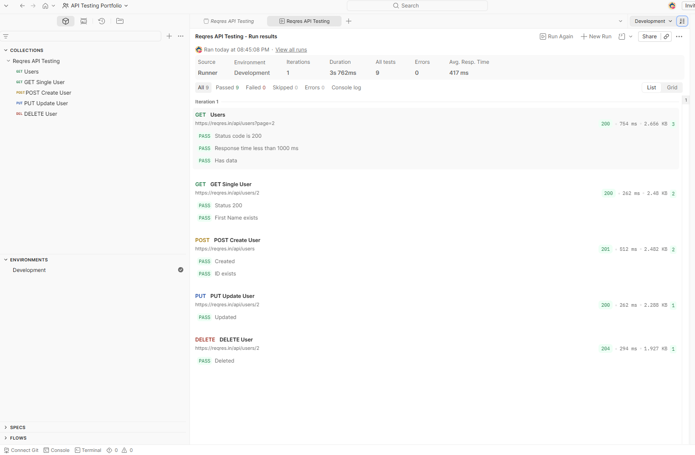
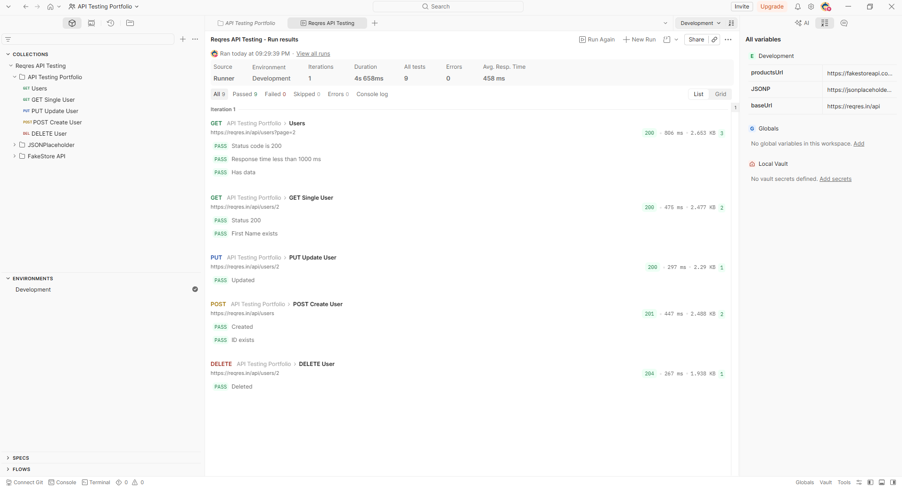
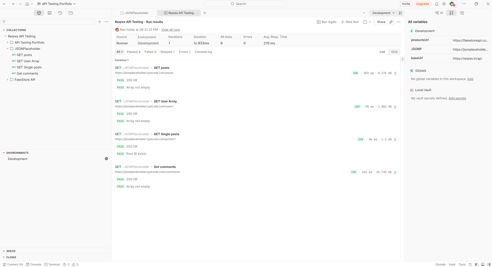
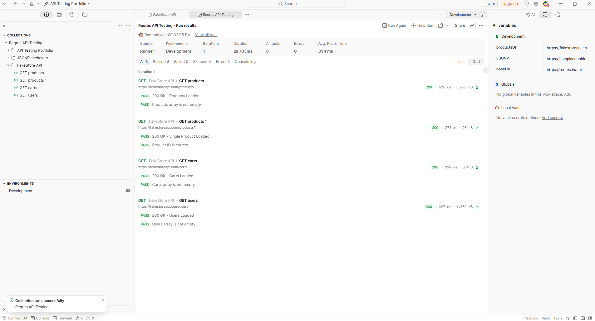

# Postman API Testing Portfolio

โปรเจกต์สำหรับทดสอบ REST API ด้วย **Postman** และ **Newman** เพื่อแสดงทักษะด้านการทดสอบ API (API Testing) สำหรับตำแหน่ง **Software Tester / QA Engineer**

---

## 🛠️ เทคโนโลยีและเครื่องมือที่ใช้

- Postman
- Newman
- JavaScript (Postman Test Scripts)
- REST API
- Git
- GitHub

---

## 🧪 API ที่ใช้ทดสอบ

### Reqres API

ทดสอบการทำงานของ REST API ด้วย Method ต่าง ๆ ได้แก่

- GET Users
- GET Single User
- POST Create User
- PUT Update User
- DELETE User

---

### JSONPlaceholder API

ทดสอบการดึงข้อมูลตัวอย่าง

- GET Posts
- GET Users
- GET Comments

---

### FakeStore API

ทดสอบ API สำหรับระบบร้านค้าออนไลน์

- GET Products
- GET Product by ID
- GET Users
- GET Carts

---

## ✅ รายการตรวจสอบ (Test Validation)

ภายใน Collection มีการตรวจสอบผลลัพธ์อัตโนมัติ เช่น

- ตรวจสอบ Status Code
- ตรวจสอบ Response Time
- ตรวจสอบ Response Body
- ตรวจสอบข้อมูล JSON
- ตรวจสอบจำนวนข้อมูลที่ได้รับ
- เขียน Test Script ด้วย JavaScript

---

## 📁 โครงสร้างโปรเจกต์

```text
postman-api-testing/
│
├── collections/
├── environments/
├── reports/
├── screenshots/
└── README.md
```

---

## 📷 ตัวอย่างผลการทดสอบ

### Collection Runner



### Reqres API



### JSONPlaceholder



### FakeStore API



---

## 📄 รายงานผลการทดสอบ

โปรเจกต์นี้สามารถรันผ่าน **Newman CLI** และสร้างรายงานผลการทดสอบในรูปแบบ HTML ได้

รายงานอยู่ในโฟลเดอร์

```
reports/
```

---

## 🚀 วิธีการใช้งาน

### 1. Import Collection

นำไฟล์ในโฟลเดอร์ `collections` เข้า Postman

### 2. Import Environment

นำไฟล์ในโฟลเดอร์ `environments` เข้า Postman

### 3. Run Collection

รันผ่าน Collection Runner ของ Postman

หรือรันผ่าน Newman

```bash
newman run "collections/Reqres API Testing.json"
```

---

## 💡 ทักษะที่แสดงในโปรเจกต์

- REST API Testing
- Postman Collection
- Environment Variables
- JavaScript Test Scripts
- API Validation
- Newman CLI
- HTML Test Report
- Git & GitHub

---

## 👤 ผู้จัดทำ

**Witthawat Boonpanya**

GitHub : https://github.com/witthwawt
